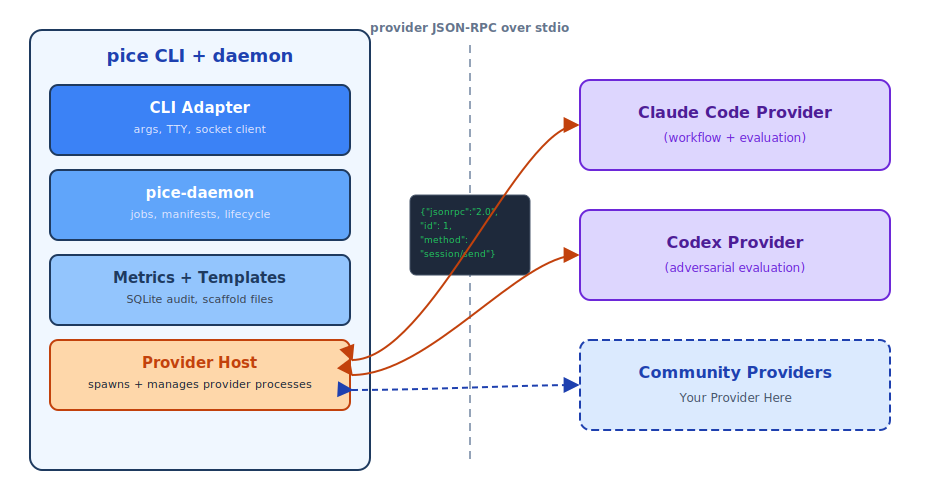
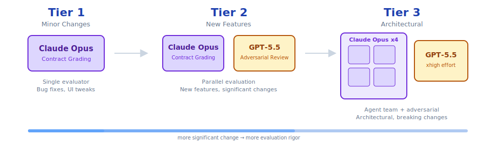

<p align="center">
  
</p>

<h1 align="center">m0lz.02</h1>

<p align="center">
  PICE CLI: a Rust daemon and CLI adapter for structured AI coding workflows.
</p>

[](https://github.com/jmolz/m0lz.02/actions/workflows/ci.yml)
[](LICENSE)

<p align="center">
  
</p>

## What It Does

m0lz.02 implements PICE: Plan, Implement, Contract-Evaluate. The v0.7.0 release line adds Stack Loops, which split a feature across technology layers, evaluate each layer against its own contract, run seam checks at integration boundaries, and keep background evaluations observable through status, logs, review gates, and audit data.

The shipped architecture is a CLI adapter plus a headless `pice-daemon`. The CLI handles arguments and terminal rendering. The daemon owns orchestration, background jobs, provider sessions, manifests, metrics, templates, and audit state. AI providers run out of process over the provider JSON-RPC protocol.

## Install

```bash
npm install -g @jacobmolz/pice
```

The npm package installs a platform package containing both `pice` and `pice-daemon`. The wrapper resolves both binaries and passes the daemon path to the CLI so background mode does not require a manual `PATH` edit.

From source:

```bash
cargo install pice-cli
```

Prebuilt archives are published from GitHub Releases when a tag is approved.

## Quick Start

```bash
pice init
pice init --upgrade
pice layers detect --json
pice layers check --json
pice validate --json
pice plan "add account settings"
pice execute <plan.md>
pice evaluate <plan.md> --background --wait --timeout-secs 120
pice status <feature-id> --json
pice logs <feature-id> --json
pice review-gate --list --feature-id <feature-id> --json
```

`pice init` scaffolds public workflow files under `.claude/` and project config under `.pice/`. This repo also uses `.codex/` for maintainer-local command and planning context; that namespace is not what fresh user projects receive from `pice init`.

## Stack Loops

Stack Loops turn one feature into layer-specific loops:

1. Detect layers from source, infrastructure, database, deployment, and observability files.
2. Cascade dependencies so upstream changes activate downstream checks.
3. Always run infrastructure, deployment, and observability layers unless the project explicitly overrides that policy.
4. Evaluate independent DAG cohorts concurrently when `phases.evaluate.parallel` is enabled.
5. Halt adaptively when confidence, budget, gate, cancellation, or max-pass rules decide the result.
6. Persist the manifest to `~/.pice/state/{project-hash}/{feature-id}.manifest.json`.

See [the Stack Loops guide](docs/guides/stack-loops.md) and [the v0.1 to v0.2 migration guide](docs/guides/migration-v01-to-v02.md).

## Commands

| Command | Purpose |
| --- | --- |
| `pice init` | Scaffold `.claude/` and `.pice/` files |
| `pice prime` | Orient on the current project |
| `pice plan <description>` | Create a plan and contract |
| `pice execute <plan>` | Implement from a plan in a fresh provider session |
| `pice evaluate <plan>` | Evaluate a plan contract, including background mode |
| `pice review` | Run code review and regression checks |
| `pice commit` | Create a standardized commit |
| `pice handoff` | Capture session state |
| `pice status [feature-id]` | Inspect manifests; `--follow --stream-json` tails live updates |
| `pice logs <feature-id>` | Inspect captured provider logs; `--follow --stream-json` tails live chunks |
| `pice metrics` | Aggregate local quality metrics |
| `pice benchmark` | Compare workflow effectiveness |
| `pice layers detect/list/check/graph` | Manage layer configuration |
| `pice validate` | Validate `.pice/` workflow, layer, and contract config |
| `pice daemon start/status/stop/restart/logs` | Manage the headless daemon |
| `pice audit` | Export gate and audit data |
| `pice review-gate` | List or decide pending human review gates |
| `pice completions <shell>` | Generate shell completions |

Every command that returns structured data supports `--json`; follow modes use newline-delimited `--stream-json` frames.

## Architecture

<picture>
  <source media="(prefers-color-scheme: dark)" srcset="docs/images/architecture-dark.svg">
  
</picture>

There are two JSON-RPC boundaries:

- CLI to daemon: socket transport for commands, background jobs, subscriptions, and daemon lifecycle.
- Daemon to provider: stdio transport for workflow and evaluation providers.

Provider failures are allowed to degrade evaluation, but they must not crash the CLI. Provider stdout is reserved for JSON-RPC; provider logs go to stderr.

## Evaluation

<picture>
  <source media="(prefers-color-scheme: dark)" srcset="docs/images/evaluation-tiers-dark.svg">
  
</picture>

Evaluators are context-isolated. A layer evaluator sees its layer contract, filtered diff, and project guidance text carried on the compatibility `claudeMd` wire field. It does not receive implementation chat, plan rationale, sibling layer contracts, or unrelated findings.

Tier 2 runs primary contract grading plus adversarial review. Tier 3 adds agent-team evaluation. Adaptive evaluation respects the correlated-evaluator confidence ceiling documented in [convergence analysis](docs/research/convergence-analysis.md).

## Configuration

Project config lives in `.pice/config.toml`; Stack Loops behavior lives in `.pice/workflow.yaml` and `.pice/layers.toml`.

```toml
[provider]
name = "claude-code"

[evaluation.primary]
provider = "claude-code"
model = "claude-opus-4-6"

[evaluation.adversarial]
provider = "codex"
model = "gpt-5.5"
effort = "xhigh"
enabled = true

[telemetry]
enabled = false

[metrics]
db_path = ".pice/metrics.db"
```

Required environment variables depend on the providers you enable:

| Variable | Used by |
| --- | --- |
| `ANTHROPIC_API_KEY` | Claude provider workflow and evaluation sessions |
| `OPENAI_API_KEY` | Codex adversarial evaluation |

## Metrics And Telemetry

Metrics are local SQLite data in `.pice/metrics.db`. v0.7.0 records evaluation rows, pass events with cost fields, seam findings, layer runs, and gate decisions. The release inventory script writes fresh schema evidence to `docs/releases/metrics-schema-evidence.json`; the Phase 8 reference harness writes runtime row-count evidence to `docs/releases/phase8-reference-evidence.json`.

Telemetry is opt-in and disabled by default. Public telemetry claims are limited to aggregate workflow events; local metrics can include project-specific identifiers, but outbound telemetry must not send code, prompts, file paths, secrets, or PII.

## Release Evidence

Release evidence for v0.7.0 is recorded in [docs/releases/v0.7.0.md](docs/releases/v0.7.0.md).

Current branch evidence from May 12, 2026:

| Check | Result |
| --- | --- |
| Rust tests | `cargo test --workspace --all-targets`: 1237 passed |
| Rust doc tests | `cargo test --workspace --doc`: 1 ignored documentation example |
| Rust docs | `RUSTDOCFLAGS='-D warnings' cargo doc --workspace --no-deps`: passed |
| TypeScript tests | `pnpm test`: 97 passed |
| Rust lint/format | `cargo fmt --check`; `cargo clippy --workspace --all-targets -- -D warnings` |
| TypeScript lint/typecheck/build | `pnpm lint`; `pnpm typecheck`; `pnpm build` |
| Release build | `cargo build --release` |
| Speedup gate | `parallel_cohort_speedup_assertion`: ratio `0.566`, target `<= 0.625` |
| Criterion benchmark | Sequential `[586.49 ms, 593.39 ms]`; parallel `[347.03 ms, 350.09 ms]` |

Environment: local macOS arm64 development host in the Phase 8 worktree on May
12, 2026. The speedup assertion is the release gate; the Criterion numbers are
informational benchmark output from the same validation pass.

The Phase 8 acceptance suite is:

```bash
node scripts/acceptance/metrics-schema-inventory.mjs
node scripts/acceptance/phase8-reference-projects.mjs
tar -czf /private/tmp/pice-release-smoke-local.tar.gz -C target/release pice pice-daemon
PICE_ARTIFACT_ARCHIVE=/private/tmp/pice-release-smoke-local.tar.gz PICE_NPM_PACK_SMOKE=1 node scripts/acceptance/release-artifact-smoke.mjs
node scripts/acceptance/readme-media-audit.mjs
```

## Provider Development

Providers declare `workflow`, `evaluation`, and optional telemetry capabilities during `initialize`. Protocol changes must update both Rust and TypeScript types and add roundtrip tests on both sides.

Read [building a provider](docs/providers/building-a-provider.md) and [the provider protocol](docs/providers/protocol.md).

## Contributing

See [CONTRIBUTING.md](CONTRIBUTING.md). Full validation includes Rust format, clippy, tests, TypeScript lint/typecheck/tests/build, release build, Phase 8 acceptance harnesses, and artifact smoke.
